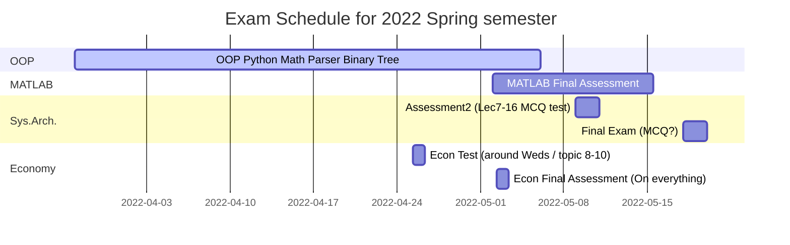

# Exam / Assessment Schedule
Here is the schedule for the rest of this semester.

```mermaid
gantt
dateFormat DD-MM-YYYY-HH
title Exam Schedule for 2022 Spring semester

section OOP
OOP Python Math Parser Binary Tree	:active, oop3, 28-03-2022-00,06-05-2022-00

section MATLAB
MATLAB Final Assessment		:	mafx, 02-05-2022-00,15-05-2022-12

section Sys.Arch.
Assessment2 (Lec7-16 MCQ test)	:	csatest, 09-05-2022-00,48h
Final Exam (MCQ?)		:	csafx, 18-05-2022-00,48h

section Economy
Econ Test (around Weds / topic 8-10)	:	ec4, 25-04-2022-09,24h
Econ Final Assessment (On everything):	ec5, 02-05-2022-09,24h
```
